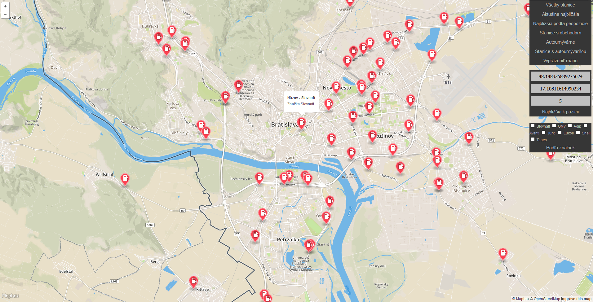

*Dokumentácia semestrálneho projektu z PDT*
*Akademický rok 2015/2016, zimný semester*
*Autor - Lukáš Markovič*

# Prehľad projektu
Systém predstavuje mapovú aplikáciu, ktorá umožňuje zobrazovať benzínové stanice v Bratislave a blízkom okolí pomocou značiek umiestnených priamo na mape.
Najdôležitejšie funkcie aplikácie sú nasledovné:
 - Zobraziť všetky dostupné benzínové stanice v Bratislave a okolí
 - Zobraziť najbližšie stanicu k aktuálnemu stredu mapy
 - Zobraziť stanovený počet najbližších staníc k zadanému bodu na mape (zvoliť dvojklikom do mapy)
 - Zobraziť iba stanice, ktorých súčasťou je obchod
 - Zobraziť auto-umyvárne v Bratislave a blízkom okolí
 - Zobraziť benzínové stanice, ktorých súčasťou je auto-umyváreň
 - Zobraziť stanice podľa konkrétneho typu značky - možno kombinovať
 - 
Aplikácia vyzerá nasledovne:

Aplikácia je rozdelená na dve samostatné časti a to klientsku časť ktorú predstavuje [webový frontend](#frontend) využívajúci mapbox.js API a  [backend](#backend), vytvorený pomocou Java EE. Súčasťou backendu je taktiež databáza PostGIS. Na komunikáciu medzi frontednom a backednom je využité jednoduché [REST API](#api) (služby volané iba pomocou URL) . Prístup k databáze je realizovaný priamo z backend aplikácie pomocou JDBC konektora.

# Frontend
Frontend predstavuje jednoduchý HTML stránku (`map.html`),  ktorá využíva `mapbox.js` pre zobrazenie mapy a prácu s ňou. Na mape, ktorá je vykreslená v klasickom `"street" štýle` sú zobrazované jednotlivé benzínové stanice pomocou štandardných bodových značiek.
Zdrojové kódy frontend aplikácie sú v súbore `map.html`, ktorého priamou súčasťou sú aj JavaScript skripty slúžiace na modifikovanie ovládanie mapy, respektíve volania REST webových služieb pomocou `jQuery`. Druhý súbor, ktorý tvorí frontend aplikáciu je súbor `menu.css`, v ktorom sú poskytnuté štýly pre ovládacie prvky aplikácie.

Základné úlohy frontend aplikácie sú nasledovné:
 - vykresľovať a ovládať mapu pomocou mapbox API (mapbox.js)
 - vykresľovať ovládacie prvky tak, aby bolo možné aplikácie pohodlne ovládať (HTML + CSS)
 - získavať výstupy REST webových služieb poskytovaných backendom (jQuery)

# Backend
Backend je realizovaný ako Java EE aplikácie využívajúca klasický `ws.rs` REST modul Javy. Projekt je realizovaný ako webová, server side aplikácia a pre svoj beh je nutné aplikáciu nasadiť na na servlet kontajner, ako napríklad `Apache Tomcat`.
Webové služby sú vystavené v triede `DataController`, ktoré následne pristupuje k databázovej vrstve a metódam poskytovaným triedou `QueryManager`. Pripojenie k databáze realizuje trieda `PostgisConnector`.
Aplikácia je vytvorená ako maven projekt a využíva nasledovné externé moduly (podrobnosti v `pom.xml`):
 - postgresql - JDBC konektor (verzia 9.4-1205-jdbc42)
 - json - práca s JSON formátom (verzia 20150729)
 - jaxrs-ri - REST api (verzia 2.22.1)

## Data
Údaje boli získané priamo pomocou exportu z `Open Street Maps` (openstreetmaps.org). Vzhľadom na limit pre export dát pracuje aplikácia iba s Bratislavou a jej blízkym okolím.
Údaje boli importované do PostGIS databázy pomocou nástroja `osm2pgsql` (použitá dosť problematická verzia pre Windows). Schéma, ktorá bola použitá pri osm2pgsql importe je uložená taktiež v GitHub repozitári v priečinku DBS.
Import dát prebiehal dosť problematicky. Údaje sa nepodarilo importovať vo formáte `WGS 84`, ale iba v defaultnom formáte, preto sú súradnice pri každom dopyte transformované do formátu `WGS 84`, napríklad pomocou `ST_Transform(way, 4326))`.
Výstupom z databázy je GeoJson, získaný pomocou funkcie `ST_AsGeoJSON` v ktorom sú uložené informácie o geopozícii konkrétneho bodu. Následne je vytváraná JSON odpoveď, ktorá predstavuje priamy vstup pre pre zobrazenie údajov na mape. Jednotlivé dopyty do databázy sa nachádzajú v triede `QueryManager`.

## Api
Backend poskytuje jednoduché REST API, teda vystavené webové služby, ktoré sú volané frontendom. Poskytované služby sú nasledovné:

**Nájsť všetky dostupné stanice**

`GET /all`

**Nájsť všetky stanice, ktorých súčasťou je obchod **

`GET /shop`

**Nájsť všetky auto-umyvárne**

`GET /wash`

**Nájsť všetky stanice, ktorých súčasťou je auto-umyváreň**

`GET /withwash`

**Nájsť stanovený počet staníc najbližších k zadaným koordinátom**

`GET /nearest/{n}/{e}/{limit}`

**Nájsť stanice, o zadaných značkách**
Link je mierne komplikovaný a neflexibilný, ale nepodarilo sa mi úspešne zavolať webovú službu iným spôsobom, preto bol uprednostnený tento prístup. Každá značka je označená ako true, ak spadá do vyhľadávanie, alebo false, ak nie.

`GET /brands/{cb1}/{cb2}/{cb3}/{cb4}/{cb5}/{cb6}/{cb7}/{cb8}/`

### Response
Návratovou hodnotou API volaní je JSON, ktorý obsahuje tri kľúče a to `geometry`, čo predstavuje GeoJson, `type`, ktorý predstavuje typ, o akú štruktúru ide (point, polygon, atď.) a `properties`, kde sú doplnkové informácie o bode. Výstup REST api je plne kompatibilný so vstupom pre mapbox.js API. Príklad je uvedený nižšie:

{
      "geometry":{
         "coordinates":[
            17.0658876218538,
            48.1479996739278
         ],
         "type":"Point"
      },
      "type":"Feature",
      "properties":{
         "marker-symbol":"fuel",
         "marker-color":"#fc4353",
         "description":"Agip",
         "title":"Agip",
         "marker-size":"large"
      }
}
